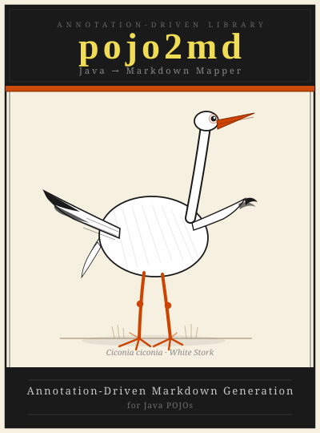

# pojo2md

<p align="center">
  
</p>

[](https://central.sonatype.com/artifact/io.github.jaroslawdabrowski/pojo2md)
[](https://opensource.org/licenses/MIT)
[](https://openjdk.org/)

A Java library for generating Markdown from plain Java objects — annotation-driven, like Jackson for JSON but for Markdown output.

Define your document structure as a plain Java class, annotate the fields, and call `writeValueAsString()`. The library handles the rest.

---

## Quick Start

```java
class Report {
    @Heading(level = 1, value = "Q1 Summary")
    @Paragraph
    String intro = "This report covers Q1 2026 performance.";

    @Heading(level = 2, value = "Key Metrics")
    @UnorderedList
    List<String> metrics = List.of(
        "Revenue: $1.2M (+12%)",
        "Active users: 45,000",
        "Churn: 2.3%"
    );
}

String md = new MarkdownMapper().writeValueAsString(new Report());
```

Output:

```markdown
# Q1 Summary

This report covers Q1 2026 performance.

## Key Metrics

- Revenue: $1.2M (+12%)
- Active users: 45,000
- Churn: 2.3%
```

---

## Installation

```xml
<dependency>
    <groupId>io.github.jaroslawdabrowski</groupId>
    <artifactId>pojo2md</artifactId>
    <version>1.0.6</version>
</dependency>
```

Requires **Java 21+**.

---

## Annotations

### `@Heading`

Renders a Markdown heading before the field content. `value` is required and provides the static heading text.

```java
@Heading(level = 2, value = "Introduction")
@Paragraph
String intro = "Welcome to the docs.";
```

```markdown
## Introduction

Welcome to the docs.
```

**Standalone heading** — use a null field when you only want the heading with no content below:

```java
@Heading(level = 1, value = "My Document")
String dummy = null;
```

```markdown
# My Document
```

**Composable** — stack `@Heading` with any content annotation:

```java
@Heading(level = 2, value = "Steps")
@OrderedList
List<String> steps = List.of("Install", "Configure", "Run");
```

```markdown
## Steps

1. Install
2. Configure
3. Run
```

**Nested content** — `@Heading` alone on a POJO or list field renders the heading then the nested content (no `@Section` needed):

```java
@Heading(level = 2, value = "Agenda")
List<AgendaItem> items = List.of(...);
```

---

### `@Paragraph`

Renders a `String` or `Markdown` field as a paragraph block.

```java
@Paragraph
String description = "A plain text paragraph.";

@Paragraph
Markdown formatted = Markdown.of().b("Bold").t(" and ").i("italic").t(" text.");
```

```markdown
A plain text paragraph.

**Bold** and *italic* text.
```

---

### `@BlockQuote`

Renders a `String` or `Markdown` field as a block quote. Supports nesting via `level`.

```java
@BlockQuote
String note = "This is important.";

@BlockQuote(level = 2)
String nested = "Deeply nested quote.";
```

```markdown
> This is important.

>> Deeply nested quote.
```

---

### `@OrderedList` / `@UnorderedList`

Renders a `List<String>` or `List<Markdown>` as a numbered or bulleted list.

```java
@OrderedList
List<String> steps = List.of("First", "Second", "Third");

@UnorderedList
List<Markdown> items = List.of(
    Markdown.of().b("Alpha"),
    Markdown.of().b("Beta")
);
```

```markdown
1. First
2. Second
3. Third

- **Alpha**
- **Beta**
```

---

### `@Section`

Embeds a nested POJO or `List<POJO>` **without** a heading. Use this when you want to inline structured content directly.

```java
class Summary {
    @Paragraph
    String text = "Details below.";
}

class Document {
    @Section
    Summary summary = new Summary();
}
```

```markdown
Details below.
```

> When a heading is present, use `@Heading` alone — adding `@Section` is unnecessary.

---

### `@Table` / `@Column`

Renders a `List<RowPojo>` as a Markdown table. Each column in the row class is declared with `@Column`.

```java
class Employee {
    @Column(header = "Name")
    String name;

    @Column(header = "Role", alignment = Align.CENTER)
    String role;

    @Column(header = "Since", alignment = Align.RIGHT)
    String since;
}

class Report {
    @Heading(value = "Team")
    @Table
    List<Employee> employees = List.of(
        new Employee("Alice", "Developer", "2020"),
        new Employee("Bob", "Designer", "2022")
    );
}
```

```markdown
## Team

| Name | Role | Since |
| --- | :---: | ---: |
| Alice | Developer | 2020 |
| Bob | Designer | 2022 |
```

**Column alignment** is controlled by `Align`:

| Value | Separator | Example |
|-------|-----------|---------|
| `Align.NONE` (default) | `---` | left-aligned (default) |
| `Align.LEFT` | `:---` | explicit left |
| `Align.CENTER` | `:---:` | centered |
| `Align.RIGHT` | `---:` | right-aligned |

**Cell values** support plain `String`, `Markdown` (bold, italic, inline code), or any object via `toString()`.
Pipe characters (`|`) are automatically escaped; newlines are collapsed to a space.

An empty list renders the header and separator rows only (no data rows).

---

## Inline Formatting with `Markdown`

The `Markdown` builder creates inline-formatted content for use with `@Paragraph`, `@BlockQuote`, and list fields.

```java
Markdown body = Markdown.of()
    .b("Bold")       // **Bold**
    .t(" normal ")   // normal text
    .i("italic")     // *italic*
    .newLine()       // soft line break (two spaces + \n)
    .t("next line");
```

| Method | Output |
|--------|--------|
| `.t("text")` | `text` |
| `.b("text")` | `**text**` |
| `.i("text")` | `*text*` |
| `.newLine()` | soft line break (`  \n`) |

---

## Nested POJOs

Annotated fields in nested POJOs are rendered recursively. Each nested object is processed using the same annotation-driven rules and the results are joined with blank lines.

```java
class Section {
    @Paragraph
    String body;

    @UnorderedList
    List<String> points;
}

class Document {
    @Heading(level = 2, value = "Overview")
    @Section
    Section overview = new Section();
}
```

---

## Full Example

A complete meeting document built from a nested object graph:

```java
class AgendaItem {
    @Paragraph
    Markdown title;

    @Heading(level = 4, value = "Participants")
    @UnorderedList
    List<String> participants;

    AgendaItem(String titleText, List<String> participants) {
        this.title = Markdown.of().b(titleText);
        this.participants = participants;
    }
}

class ActionItem {
    @Column(header = "Task")
    String task;

    @Column(header = "Owner", alignment = Align.CENTER)
    String owner;

    @Column(header = "Due", alignment = Align.RIGHT)
    String due;

    ActionItem(String task, String owner, String due) {
        this.task = task;
        this.owner = owner;
        this.due = due;
    }
}

class Meeting {
    @Heading(level = 1, value = "Q1 Planning Meeting")
    @Paragraph
    Markdown meta = Markdown.of()
            .b("Date:").t(" 2026-03-10").newLine()
            .b("Location:").t(" Conference Room A").newLine()
            .b("Duration:").t(" 60 minutes");

    @Heading(level = 2, value = "Participants")
    @UnorderedList
    List<String> participants = List.of(
            "Alice Smith — Product Manager",
            "Bob Jones — Engineering Lead",
            "Carol White — Design",
            "Dave Brown — QA"
    );

    @Heading(level = 2, value = "Agenda")
    List<AgendaItem> agendaItems = List.of(
            new AgendaItem("Status Update", List.of("Alice Smith", "Bob Jones")),
            new AgendaItem("Blockers", List.of("Carol White")),
            new AgendaItem("Q2 Roadmap", List.of("Alice Smith"))
    );

    @Heading(level = 3, value = "Action Items")
    @Table
    List<ActionItem> actionItems = List.of(
            new ActionItem("Finalize API documentation", "Bob", "March 12th"),
            new ActionItem("Share updated mockups in Slack", "Carol", "March 17th")
    );

    @BlockQuote
    String nextMeeting = "Next meeting scheduled for March 17, 2026 at 10:00 AM";
}

String md = new MarkdownMapper().writeValueAsString(new Meeting());
```

Output:

```markdown
# Q1 Planning Meeting

**Date:** 2026-03-10
**Location:** Conference Room A
**Duration:** 60 minutes

## Participants

- Alice Smith — Product Manager
- Bob Jones — Engineering Lead
- Carol White — Design
- Dave Brown — QA

## Agenda

**Status Update**

#### Participants

- Alice Smith
- Bob Jones

**Blockers**

#### Participants

- Carol White

**Q2 Roadmap**

#### Participants

- Alice Smith

### Action Items

| Task | Owner | Due |
| --- | :---: | ---: |
| Finalize API documentation | Bob | March 12th |
| Share updated mockups in Slack | Carol | March 17th |

> Next meeting scheduled for March 17, 2026 at 10:00 AM
```

---

## Annotation Reference

| Annotation | Supported field types | Attributes |
|---|---|---|
| `@Heading` | any | `level` (1–6, default 1), `value` (required) |
| `@Paragraph` | `String`, `Markdown` | — |
| `@BlockQuote` | `String`, `Markdown` | `level` (default 1) |
| `@OrderedList` | `List<String>`, `List<Markdown>` | — |
| `@UnorderedList` | `List<String>`, `List<Markdown>` | — |
| `@Section` | any POJO, `List<POJO>` | — |
| `@Table` | `List<POJO>` | — |
| `@Column` | any (on row POJO fields) | `header` (required), `alignment` (default `Align.NONE`) |

### Rules

- A field with **no annotation** is always skipped.
- A field may have **at most one** content annotation (`@Paragraph`, `@BlockQuote`, `@OrderedList`, `@UnorderedList`, `@Section`, `@Table`).
- `@Heading` may be **combined** with any content annotation.
- Fields are rendered in **declaration order**.
- Blocks are separated by a **blank line** (`\n\n`).

---

## Error Handling

All mapping errors throw `MappingException` (unchecked):

- Field has more than one content annotation
- `@OrderedList` / `@UnorderedList` used on a non-`List` field
- `@Paragraph` / `@BlockQuote` used on an unsupported type
- `@Table` used on a null or non-`List` field
- Row class has no `@Column`-annotated fields
